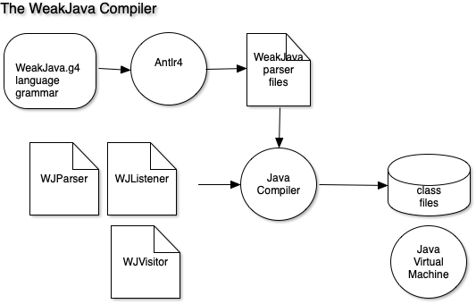

# WeakJava

## wjc - a femto-Java compiler for ziprisc1

Target of this lab is to build a executable that compiles "weakjava" code.
This lab uses Antlr4, a cool lexer/parser generator.

### Antlr4. 

ANTLR (ANother Tool for Language Recognition) is a powerful parser
generator for reading, processing, executing, or translating structured text or binary files.
It takes a `.g4` grammar file and produces a whole bunch of Java code which implements a laxer/parser program.
That in turn, produces a parse tree, which as it is "walked", can be used to produce "object code".
See the eventual Notes.md about how this all works.

    wjc - the WeakJava compiler.

    Compiles WeakJava code into zas assembly code and
    the output (stdout) should be put into a .zas file.

It will look like this

```
$ wjc < hello.wj > hello.zas
$ zas hello.zas > hello.zex
$ zrisc hello.zex
hello
```


The current compiler shows how to do a few simple things. But is highly limited. Notice, for instance,
the `IF` statement. The conditional expression is only `EQ`.

So, you need to add to this code base:

### Exercises to Add

- general relational operators for the if statement
- add a `while` loop
- make the assignment statement more general
- add a boolean type
- add a char/rune(UTF) type
- add string literals
- modify print to work with string literals
- add an `input()` function for integer input

### Harder Exercises with code base.

#### Add more control structures

- for loop
- repeat...until loop
- switch statement

#### Add more data types

- a floating point type
- a list
- a dictionary/map
- a struct/record type

#### Add interfaces

- a composable set of functions tied to a user type


## ToDos

- Need a few examples of code template patterns
- how to do while, and precedence in operators

The `docs/` diagrams are sourced with http://shapesapp.com
